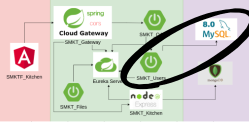

# SMKT_Users
This MS serve users in the database

## Others Micro-services
- [SMKT_Eureka](https://github.com/AntonioAlejandro01/SMKT_Eureka)
- [SMKT_Gateway](https://github.com/AntonioAlejandro01/SMKT_Gateway)
- [SMKT_Oauth](https://github.com/AntonioAlejandro01/SMKT_Oauth)
- [SMKT_Files](https://github.com/AntonioAlejandro01/SMKT_Files)
- [SMKT_Kitchen](https://github.com/AntonioAlejandro01/SMKT_Kitchen)
## Frontend
- [SMKTF_Kitchen](https://github.com/AntonioAlejandro01/SMKTF_Kitchen)
